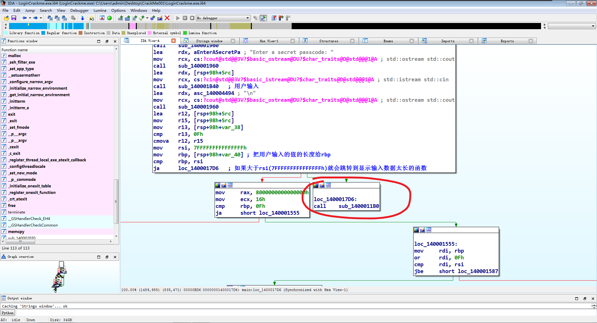
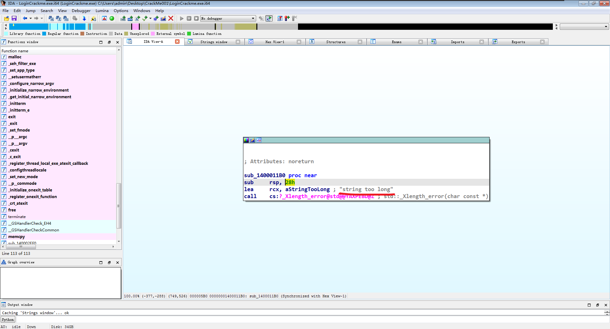
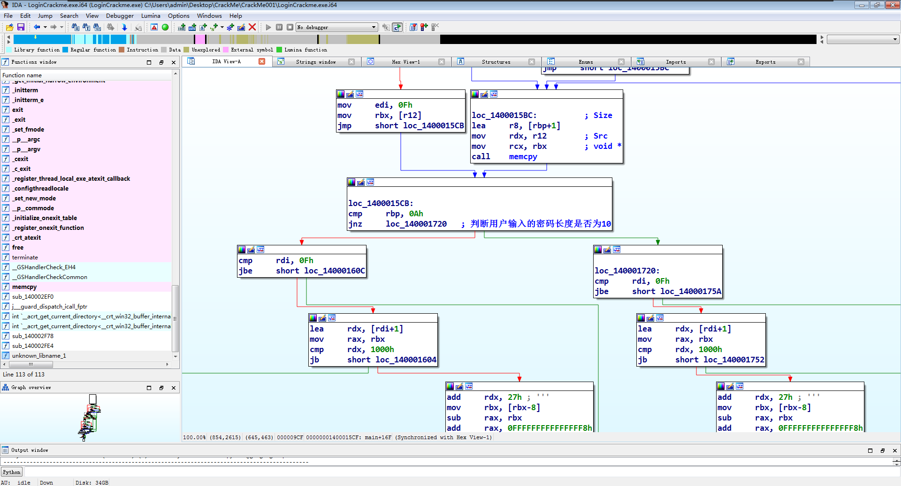

# 程序信息📄

Author: NoOff

Crackme Name: NoOff's LoginCrackme

Language: C/C++

Platform: Windows

Difficulty: 2.2

Quality: 5

Arch: x86-64

Description: Try to get the secret passphrase required to successfully login.

Link: https://crackmes.one/crackme/666732aee7b35c09bb266b1c

# 分析程序🔍

这是个控制台程序，把程序放到x64dbg或者ida pro搜索字符串"Welcome to the Secure Server!"就可以找到程序用户输入的地址以及判断是否为正确密码的流程。

# 破解方式💥

程序在用户输入完密码后会进行判断密码是否过长，如果过长就输出"string too long"。

之后开始检查用户输入密码长度是否为10，如果不是就直接跳转到密码错误的流程

最后就是开始解密密码来和用户输入的密码作判断看是否一样，如果不一样就跳转到密码错误的流程。

使用x64dbg一步步运行解密函数来查看解密函数的流程，大致上是定义一个数组和加密过的字符串，数组里面的内容是存放用户输入的密码地址的偏移量，用`for`循环进行20次循环来对加密过的字符串进行解密，每解密一个字节就与用户输入的密码其中的一个字节进行比较，如果都相同就跳转到密码正确的流程。
