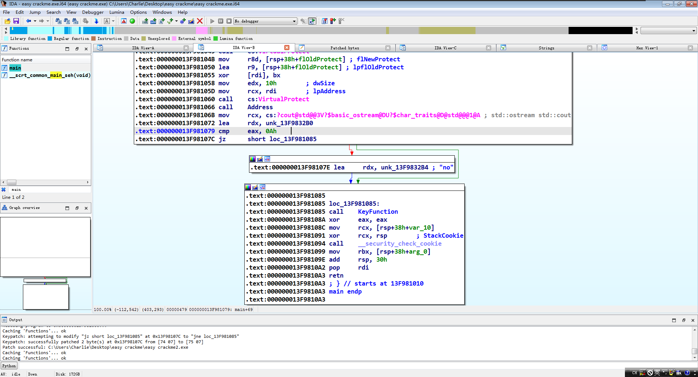
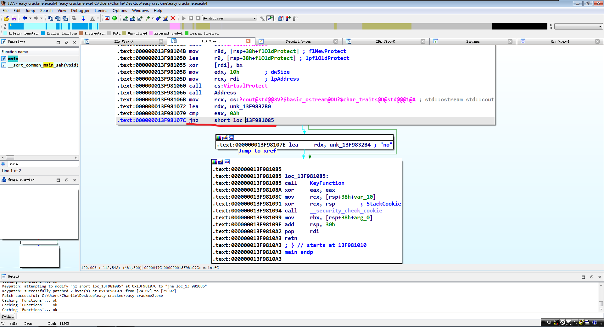

# 程序信息📄

Author: aname

Crackme Name: easy crackme

Language: C/C++

Platform: Windows

Difficulty: 1.4

Quality: 3.8

Arch: x86-64

Description: "goal: find password"

Link: https://crackmes.one/crackme/6771442d4d850ac5f7dc47c9

# 分析程序🔍

这是个控制台程序，直接修改它的判断跳转就能够破解成功。

# 破解方式💥

这里有个判断eax是否等于0xA（十进制为10）的跳转判断，如果不等于的话输出的结果就会是"no"，所以要把`je`跳转判断改成`jne`并保存修改后的程序。

之后运行修改后的程序就会输出"yes"。
