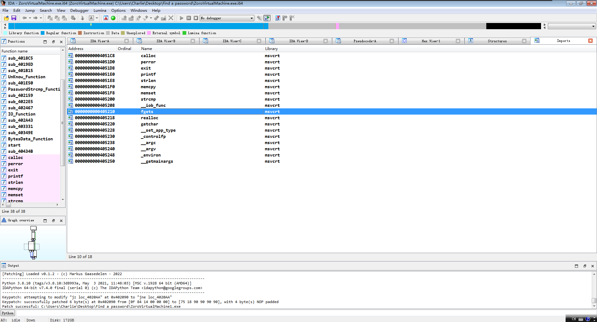
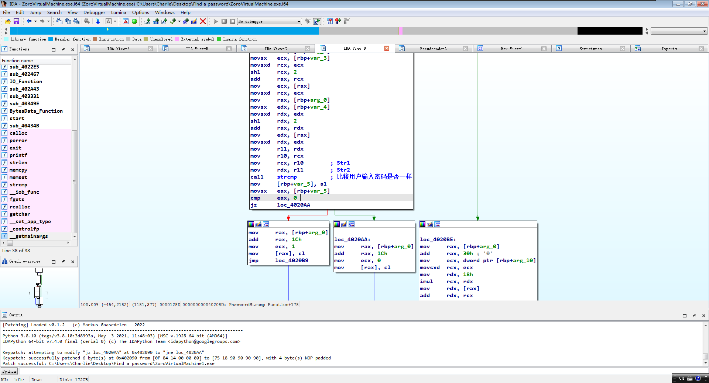
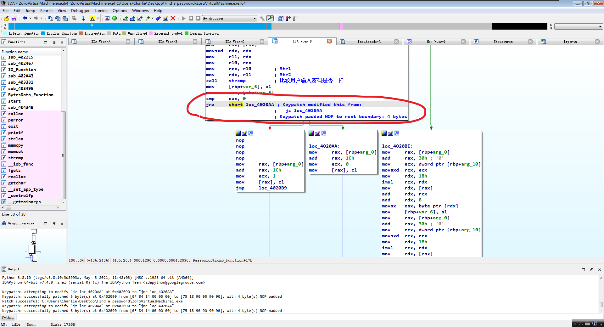
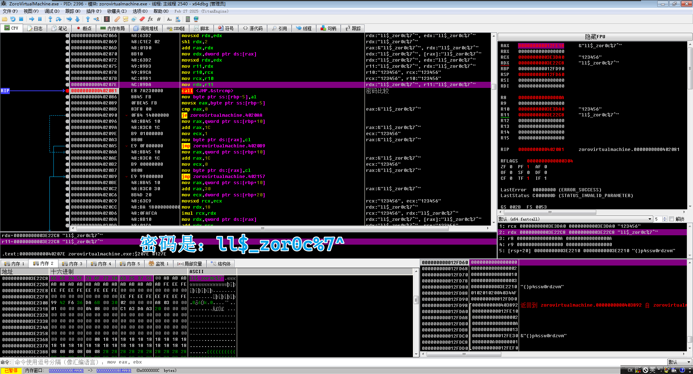

# 程序信息📄

Author: Deroxs

Crackme Name: Find a password

Language: C/C++

Platform: Windows

Difficulty: 1.2

Quality: 2.4

Arch: x86-64

Description: Find password

Link: https://crackmes.one/crackme/6640f06b6b8bd8ddfe33c826

# 分析程序🔍

这是个控制台程序，常规的查找字符串会找不到，字符串被分解成字符放在代码段部分，直接修改它的判断跳转或者从堆栈里面找出它的密码就能够破解。

# 破解方式💥

从ida pro的导入窗口可以知道这个程序获取用户输入的函数为`fgets`，以及上方有个`strcmp`字符串比较函数，这边大概可以猜测程序是以比较字符串的方式来判断密码是否正确。

在x64dbg里面对`strcmp`函数下断点并让程序运行到此处之后返回到用户代码，图片中可以看到当比较完字符串后有个跳转判断，`eax`等于0的话就表示字符串相同，不等于则表示字符串不相同。

可以修改判断跳转来达到破解成功的目的。

或者可以在x64dbg中在呼叫`strcmp`函数的代码部分察看内存找到密码。

